# Дипломное задание к курсу «Продвинутый JavaScript в браузере».

[[Github Pages](https://igor-chazov.github.io/ahj-diplom)]

---

## Медиа Органайзер

##### - яркое web-приложение, имеющее дружественный интерфейс.

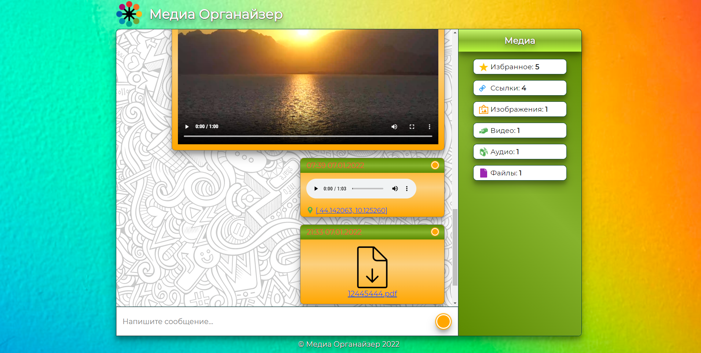

«Медиа Органайзер» - сервис для хранения и сортировки текстовых данных, ссылок и медиа файлов обладает следующим функционалом:

1. Сохранение в истории текстовых сообщений
2. Сохранение в истории ссылок
3. Разметки ссылок в сообщениях
4. Сохранение в истории изображений
5. Сохранение в истории видео-файлов
6. Сохранение в истории аудио-файлов
7. Сохранении в истории любых файлов, не относящихся к вышеуказанным форматам, для последующего скачивания
8. Загрузка изображений и файлов с использованием Drag & Drop
9. «Ленивая» подгрузка. Постепенная подгрузка сообщений (по 10 сообщений) из истории по мере прокрутки ленты сообщений.
10. Синхронизация нескольких открытых Органайзеров между собой, в том числе между отдельными вкладками в рамках одного браузера, так и между отдельными браузерами и устройствами
11. Запись аудио-сообщений с помощью встроенного микрофона
12. Запись видео-сообщений с помощью встроенной веб-камеры
13. Воспроизведение аудио-сообщений с помощью API браузера
14. Воспроизведение видео-сообщений с помощью API браузера
15. Прикрепление к сообщению позиции геолокации и просмотр отметки с помощью Яндекс.Карт
16. Закрепление сообщений. Сообщение закрепляется сверху ленты сообщений. Одновременно закреплено может быть только одно сообщение
17. Добавление сообщений в избранное и просмотр избранных сообщений
18. Автоматическая сортировка и просмотр сообщений по категориям «Избранное», «Ссылки», «Изображения», «Видео», «Аудио», «Файлы»
19. Удаление сообщений
20. Сохранение данных на сервере в безе данных DB, category, favourites, далее «Хранилище».

---

### Отправка сообщений

Ввод текстовых сообщений производится с помощью поля, расположенного в нижней части листа сообщений.

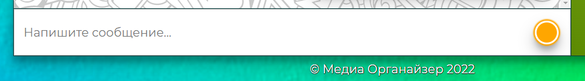

Отправка сообщений происходит по нажатию клавиши «Enter». Пустые сообщения запрещены. Полученные сообщения записываются в базу данных Органайзера и появляются в ленте сообщений. При этом в сообщении выставляется дата и время добавления в ленту сообщений.

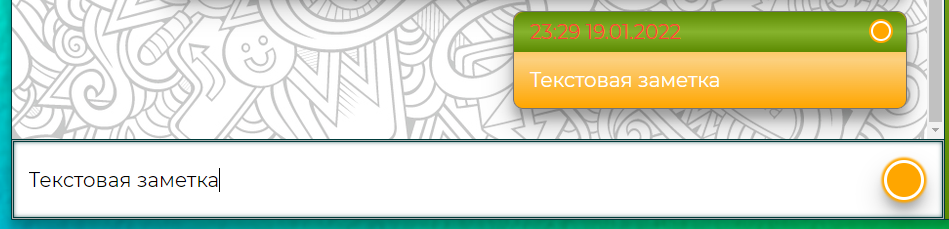

### Отправка ссылок

Отправка ссылок в ленту сообщений происходит аналогично обычному текстовому сообщению. Ссылки распознаются при наличии указанного протокола «http» или «https». В одном сообщении может быть указано несколько ссылок.

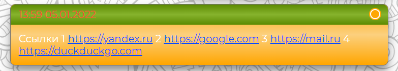

После отправки заметки на сервер, распознанные ссылки помещаются в базу данных «category» в раздел «ссылки» отдельными элементами.

### Отправка файлов

Для отправки файла необходимо выбрать соответствующую категорию в дополнительном меню формы отправки.

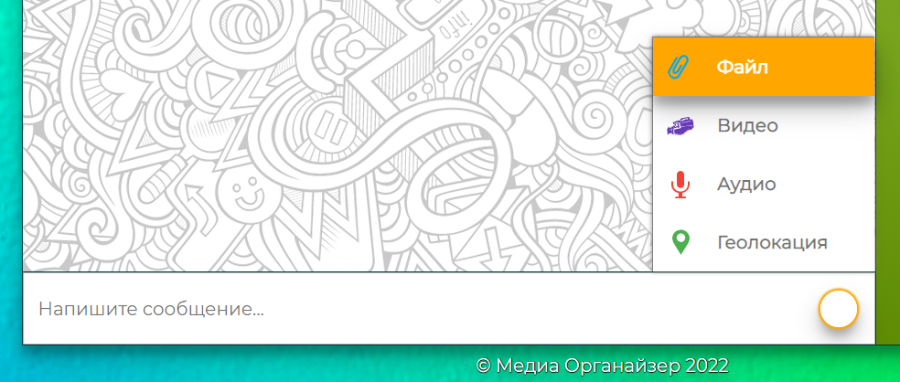

Отправка файла производится посредством нажатия кнопки «Добавить файл» в открывшейся форме,  

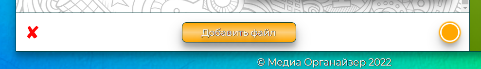

выбор файла возможен на компьютере пользователя

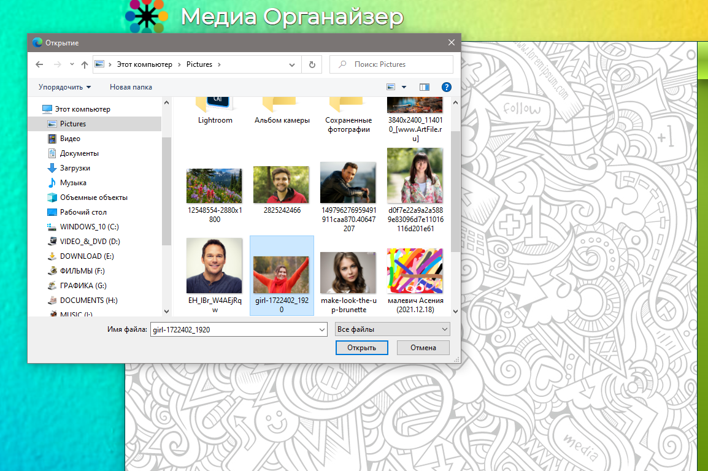

или с помощью функции Drag & Drop, то есть перетаскиванием файла в область ленты сообщений Органайзера.

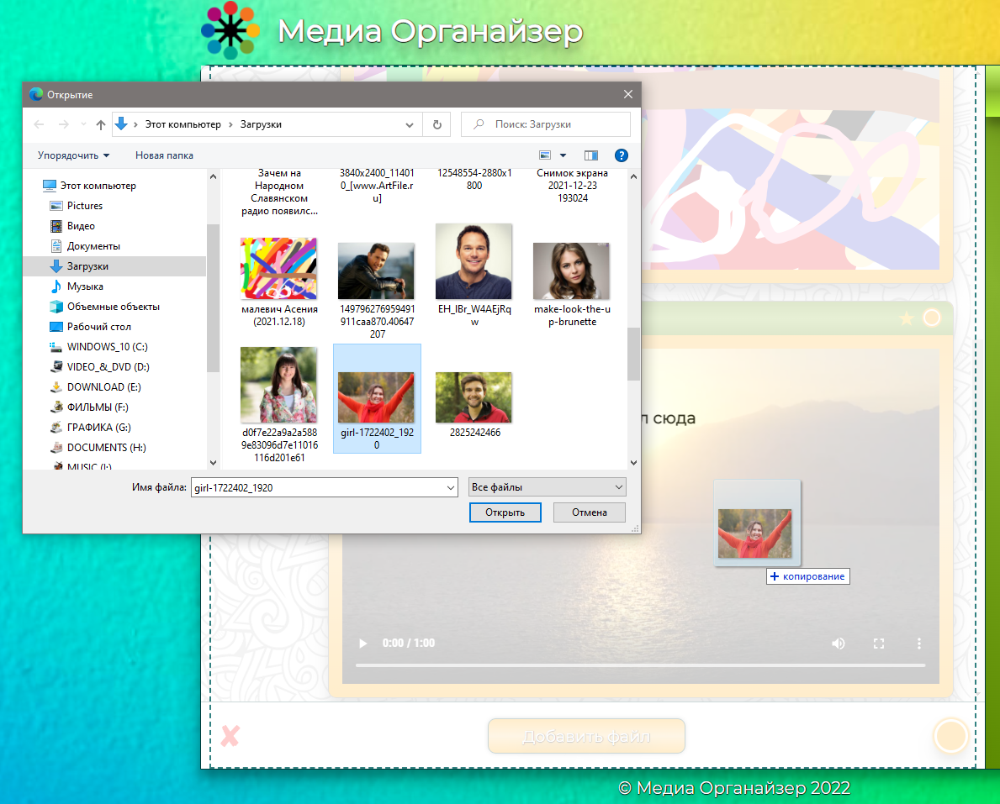

Закрытие формы производится с помощью значка «» в левой части поля ввода. 

После выбора или перетаскивания файл будет автоматически отправлен в Органайзер, распознан и добавлен в ленту сообщений и в Хранилище. При этом файлы изображений отображаются в виде миниатюры изображения, видео и аудио в виде проигрывателей, прочие файлы в виде ссылки на скачивание.

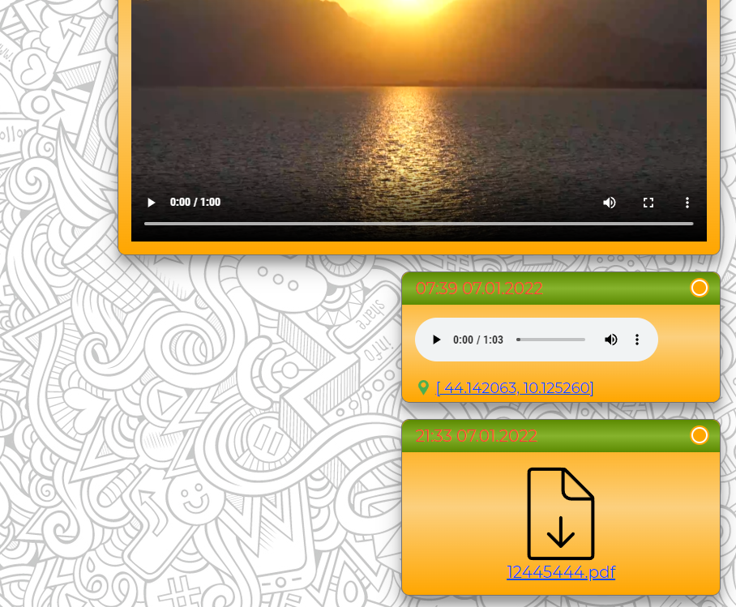

### Запись аудио и видео

Для записи «аудио» и «видео» сообщений необходимо выбрать соответствующую категорию в дополнительном меню формы отправки.

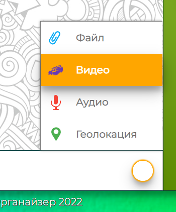 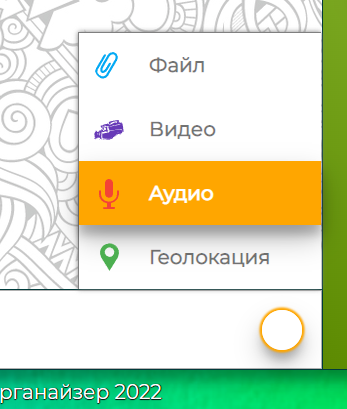

При этом необходимо предоставить соответствующие разрешения в браузере на использование микрофона и (или) видеокамеры.

Запись начинается при нажатии значка «» в открывшейся панели управления. Остановка записи производится путём надонажатия значка «», после чего сформированный файл автоматически отправляется в Органайзер, распознаётся и сортируется.

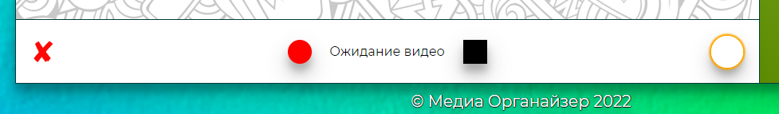

Закрыть форму управления записи «аудио» и «видео» возможно с помощью значка «» в левой части поля ввода.

### Добавление геолокации

Добавление метки геолокации к сообщению производится посредством выбора категории «Геолокация» в дополнительном меню формы отправки. При этом необходимо предоставить соответствующие разрешение в браузере. Метка геолокации добавляется к сообщению для последующей отправки и отображается в левой нижней части ленты сообщений. Удаление метки производится с помощью значка «» в правой части метки геолокации.

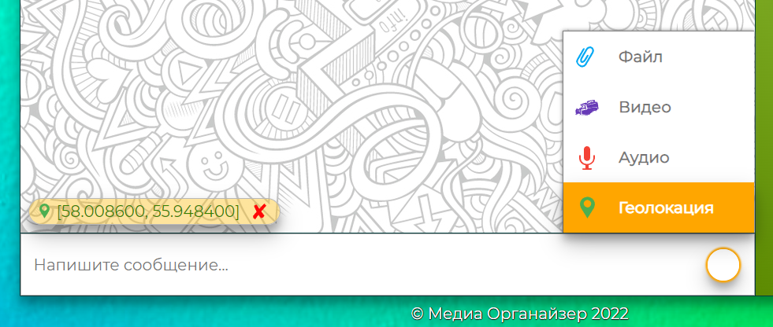

При отправке файлов или записи «аудио» и «видео» сообщений геометку необходимо добавлять перед выбором файла или перед началом записи. В ленте сообщений прикреплённая метка геолокации является ссылкой на «Яндекс.Карты» с отображением места по указанным координатам.

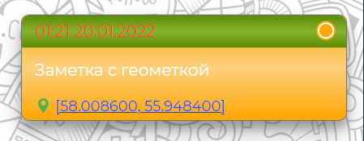

### Дополнительное интерактивное меню

При нажатии на кнопку, расположенную в верхней правой части сообщения в ленте сообщений Органайзера, открывается дополнительное интерактивная меню.

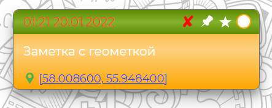

### Удаление сообщения

Удаление сообщения происходит при нажатии, в дополнительном интерактивном меню, значка «». При этом удаляется сообщение как из ленты сообщений, так и из категорий Хранилища. Если сообщение было закреплено, оно также снимается из закреплённого состояния.

### Закреплённое сообщение

Закрепление сообщения производится путём нажатия на значок «» в дополнительном интерактивном меню. При этом копия сообщения помещается в верхнюю область ленты заметок и остаётся там при прокрутке или обновлении страницы.

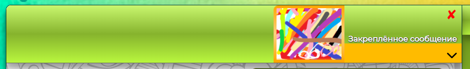

Из области закреплённого состояния доступно снятие закреплённого сообщения путем нажатия значка «» в правой верхней части закреплённого сообщения. А также дополнительный просмотр выделенного сообщения с помощью значка «». 

Снятие сообщения из закреплённого состояния также возможно путем нажатием на появившийся значок «» в сообщение, без захода в дополнительное интерактивное меню.

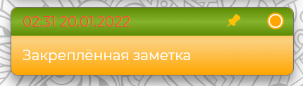

### Добавление в избранное

Добавление сообщения в избранное производится путём нажатия на кнопку «» в дополнительном интерактивном меню.

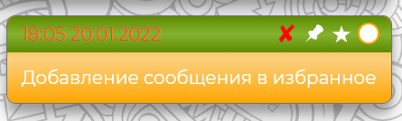

При этом сообщение заносится в категорию Хранилища «Избранное», откуда доступен просмотр всех избранных сообщений. 

Удаление сообщений из избранного происходит путем нажатием на появившуюся кнопку «», без захода в дополнительное интерактивное меню.

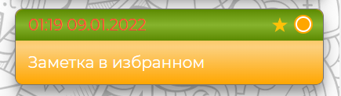

### Блок Органайзера «Медиа»

В блоке «Медиа» сохраняются и группируются сообщения по категориям:

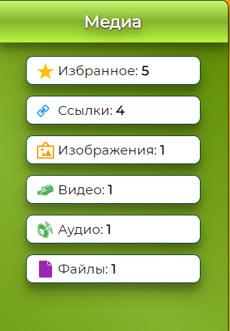

* Избранное
* Ссылки
* Изображения
* Видео
* Аудио
* Файлы

Каждая категория подразумевает возможность отдельного просмотра, определённых в ней сообщений.

### Просмотр сообщений в блоке «Медиа»

Для просмотра сообщений в блоке «Медиа» необходимо кликнуть на нужную категорию. При этом в правой части Органайзера открывается список сообщений по данной категории. Просмотр отдельного сообщения в категории производится путём нажатия на значок «» в левой части сообщения.

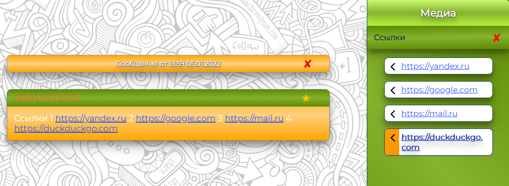

Просмотр отдельного сообщения производится в ленте сообщений Органайзера.

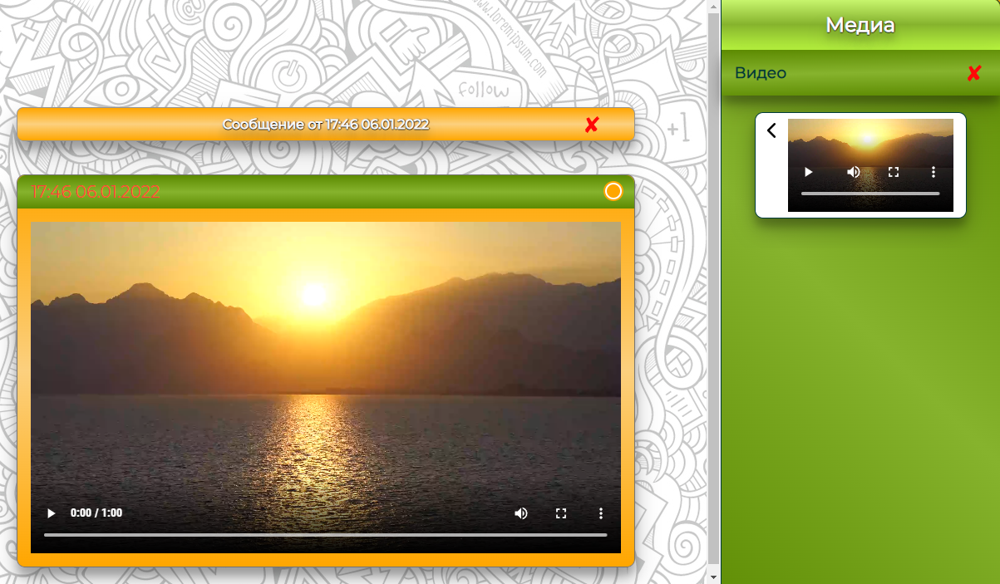

Закрыть окно и вернуться к общей ленте сообщений можно путем нажатия кнопки «» в заголовке окна отдельного сообщения в ленте сообщений Органайзера. Также окно автоматически закрывается при закрытии выбранной категории в блоке «Медиа».

### Просмотр избранных сообщений

Просмотр избранных сообщений отличается от просмотра сообщений других категорий блока «Медиа». При выборе пункта «Избранное» в блоке «Медиа» все избранные сообщения выстраиваются единым списком в ленте сообщений Органайзера

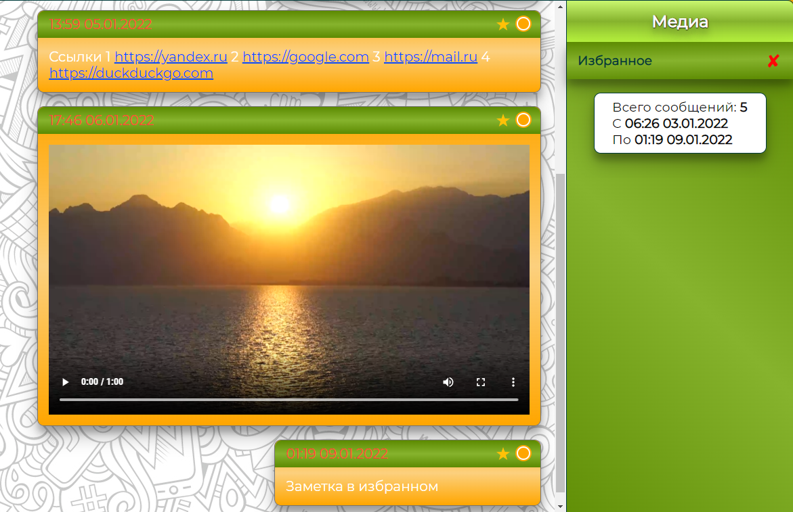

Закрытие ленты избранных сообщений производится аналогично закрытию категорий блока «Медиа» а именно нажатием на значок «» в верхней правой стороне окна блока «Медиа».

---

#### Структура приложения Органайзер:

* Chaos.js – основной класс приложения. Отвечает за визуальный рендер.
* DOM.js – построение DOM-элементов.
* Request.js – логика общения с сервером через WebSockets
* SidePanel.js – боковая панель Органайзера - блок «Медиа»
* FileLoader.js – загрузка файлов, Drag & Drop
* MediaLoader.js – запись и обработка видео и аудио сообщений
* Geolocation.js – определение геолокации
* Favourites.js – работа с избранными сообщениями
* Pin.js – закрепление сообщения

---

Web-приложение «Медиа Органайзер» опубликовано на [[Github Pages](https://igor-chazov.github.io/ahj-diplom)]

Серверная часть (бэкенд) на сервисе [[Heroku](https://ahj-diplom-backend.herokuapp.com/)]

---
